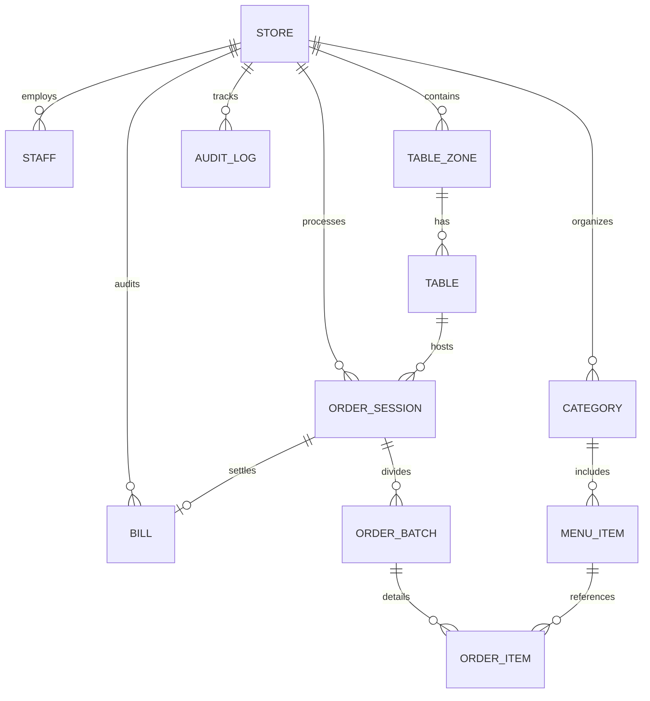

# 🗄️ ĐẶC TẢ CƠ SỞ DỮ LIỆU & QUAN HỆ THỰC THỂ (DATABASE SCHEMA)

---

## 1. NGUYÊN TẮC BẤT BIẾN ĐA THUÊ THUÊ (TENANT ISOLATION)
Mọi bảng dữ liệu nghiệp vụ (trừ bảng cấu hình hệ thống của Super Admin) đều bắt buộc chứa trường `storeId: String` có khóa ngoại trỏ về bảng `Store`.

Mọi câu truy vấn dữ liệu từ API hoặc Socket **BẮT BUỘC** phải có điều kiện:
```sql
WHERE store_id = :current_store_id
```

---

## 2. SƠ ĐỒ THỰC THỂ QUAN HỆ (ERD - MERMAID)



---

## 3. ĐẶC TẢ CHI TIẾT CÁC BẢNG DỮ LIỆU (PRISMA SCHEMA)

### 3.1. Bảng `Store` (Nhà hàng / Quán ăn)
* `id`: String (UUID/CUID) - Khóa chính.
* `name`: String - Tên quán (VD: Phở Bò Gia Truyền Nam Định).
* `slug`: String (Unique) - Định danh URL (VD: `pho-nam-dinh`).
* `phone`: String - Số điện thoại chủ quán.
* `address`: String - Địa chỉ thực tế.
* `bankAccount`: String? - Số tài khoản ngân hàng nhận tiền VietQR.
* `bankBin`: String? - Mã ngân hàng Napas (VD: 970415 - VietinBank).
* `bankOwnerName`: String? - Tên chủ tài khoản ngân hàng.
* `status`: Enum (`ACTIVE`, `TRIAL`, `SUSPENDED`) - Trạng thái hoạt động (Do Super Admin quản lý).
* `expireAt`: DateTime - Thời hạn sử dụng gói phần mềm.

### 3.2. Bảng `Staff` (Nhân sự & Phân quyền)
* `id`: String - Khóa chính.
* `storeId`: String - Thuộc nhà hàng nào.
* `name`: String - Tên nhân viên (VD: Hùng Phục Vụ, Chị Lan Thu Ngân).
* `email`: String? - Dành cho Quản lý / Kế toán đăng nhập từ xa.
* `passwordHash`: String? - Dùng khi đăng nhập email.
* `pinCode`: String? (4 số, vd: `1234`) - Dành cho nhân viên bàn/bếp đăng nhập siêu tốc tại quán.
* `role`: Enum (`STORE_OWNER`, `ACCOUNTANT`, `CASHIER`, `CHEF`, `WAITER`).
* `isActive`: Boolean - Đang làm việc hay đã nghỉ việc.

### 3.3. Bảng `Table` (Bàn ăn & Mã QR)
* `id`: String - Khóa chính.
* `storeId`: String - Thuộc nhà hàng nào.
* `name`: String - Tên bàn (VD: Bàn 01, Bàn Ngoài Sân 03).
* `zoneId`: String - Khu vực (Tầng 1, Tầng 2, Ngoài trời).
* `status`: Enum (`EMPTY`, `OCCUPIED`, `WAITING_FOOD`, `SERVED`, `PAYMENT_PENDING`).
* `qrSecret`: String - Mã bảo mật sinh QR động theo phiên chống phá hoại từ xa.
* `currentSessionId`: String? - ID phiên ăn hiện tại đang diễn ra.

### 3.4. Bảng `MenuItem` (Món ăn & Đồ uống)
* `id`: String - Khóa chính.
* `storeId`: String.
* `categoryId`: String.
* `name`: String - Tên món (VD: Phở Tái Nạm, Trà Đào Cam Sả).
* `price`: Int - Đơn giá (VND).
* `image`: String? - Link ảnh món (tối ưu WebP).
* `isAvailable`: Boolean (Default: true) - Nút gạt 86 (Bếp bấm hết món thì chuyển false).
* `station`: Enum (`KITCHEN`, `BAR`) - Phân loại xuất món ra Bếp nấu hay Quầy pha chế.

### 3.5. Bảng `OrderSession` & `OrderBatch` (Phiên ăn & Đợt gọi món)
* Để xử lý bài toán **Khách gọi thêm đợt 2, đợt 3**:
  * `OrderSession`: Đại diện cho cả bữa ăn của bàn từ lúc vào đến lúc tính tiền xong.
  * `OrderBatch`: Đại diện cho từng lần bấm "Gửi Bếp" (Đợt 1, Đợt 2, Đợt 3).
  * `OrderItem`:
    * `menuItemId`: Khóa ngoại trỏ về Món.
    * `quantity`: Số lượng.
    * `notes`: Ghi chú (Ít cay, không hành, đá riêng...).
    * `status`: Enum (`QUEUED`, `COOKING`, `DONE`, `SERVED`, `CANCELLED`).
    * `createdAt`: Thời gian gọi để KDS tính SLA cảnh báo màu sắc.

### 3.6. Bảng `Bill` (Hóa đơn & Thanh toán VietQR)
* `id`: String - Khóa chính.
* `orderSessionId`: String.
* `storeId`: String.
* `totalAmount`: Int - Tổng tiền món.
* `discountAmount`: Int - Tiền giảm giá.
* `finalAmount`: Int - Tiền thực thu.
* `paymentMethod`: Enum (`CASH`, `VIETQR`, `CARD`).
* `paymentStatus`: Enum (`PENDING`, `PAID`, `FAILED`).
* `transactionCode`: String? - Mã giao dịch chuyển khoản VietQR đối soát.

### 3.7. Bảng `AuditLog` (Nhật ký bất biến chống gian lận)
* `id`: String.
* `storeId`: String.
* `staffId`: String.
* `action`: String (VD: `CANCEL_ITEM`, `DISCOUNT_BILL`, `MERGE_TABLE`).
* `details`: JSON (Ghi rõ món gì bị hủy, bàn nào chuyển đi đâu, ai là người duyệt).
* `createdAt`: DateTime.
