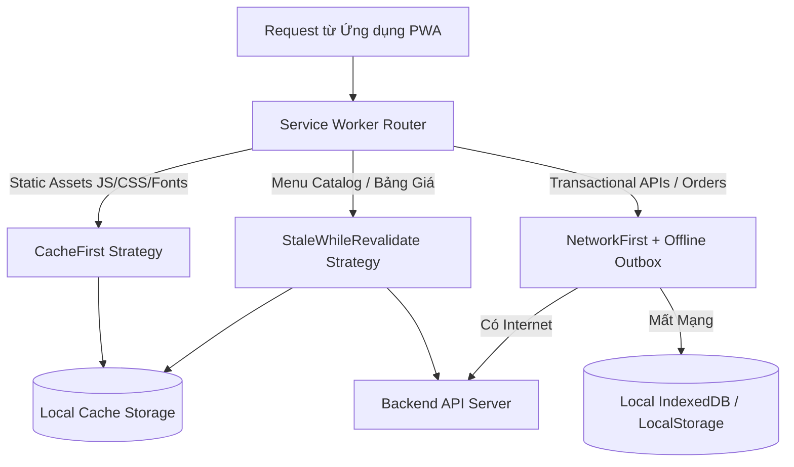
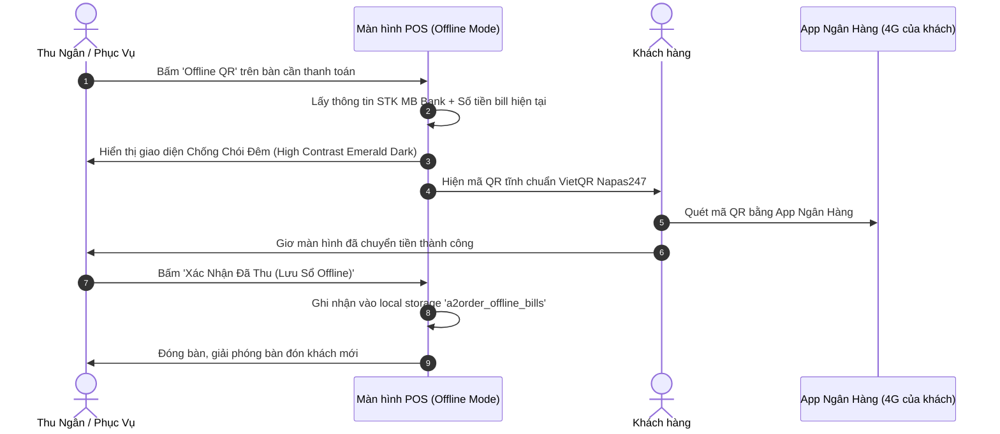

# CHIẾN LƯỢC NGOẠI TUYẾN & PWA (PWA & OFFLINE-FIRST STRATEGY)

---

## 1. BỐI CẢNH VẬN HÀNH F&B TẠI VIỆT NAM

Các sự cố bất khả kháng thường xuyên xảy ra tại quán ăn, quán cà phê:
1. **Rớt mạng Internet**: Đứt cáp quang, nhà mạng bảo trì, router Wi-Fi quán bị quá tải do khách truy cập đông.
2. **Mất điện đột ngột**: Cúp điện lưới, máy tính bàn POS tắt ngấm.
3. **Quán ở tầng hầm hoặc góc khuất sóng 4G chập chờn**.

Nếu hệ thống POS chỉ chạy Web thuần và phụ thuộc 100% vào Internet, toàn bộ khâu gọi món, in bill và thanh toán sẽ bị tê liệt, dẫn đến thất thoát tiền và khách bỏ về. **A2Order được thiết kế theo tư duy Offline-First / PWA** để đảm bảo quán vẫn hoạt động liên tục ngay cả khi mất mạng hoàn toàn.

---

## 2. KIẾN TRÚC PWA & SERVICE WORKER (WORKBOX STRATEGY)



### 2.1. Phân loại chiến lược lưu bộ đệm (Caching Strategies)
* **Static Assets (HTML, JS, CSS, Web Fonts, UI Icons)**:
  * Chiến lược: `CacheFirst`.
  * Thời hạn bộ đệm: 30 ngày (Pre-cached tự động qua `vite-plugin-pwa`).
  * Tác dụng: Ứng dụng mở lên ngay lập tức trong 0.2 giây mà không cần tải lại file từ server.
* **Menu Thực Đơn & Danh Mục Món**:
  * Chiến lược: `StaleWhileRevalidate`.
  * Tác dụng: Menu luôn hiển thị được ngay lập tức từ bộ nhớ máy, ngầm cập nhật phiên bản mới nhất nếu có Internet.
* **Dữ liệu Giao dịch & Đơn hàng (Orders & Billing)**:
  * Chiến lược: `NetworkFirst` kết hợp `Offline Outbox`.

---

## 3. CHẾ ĐỘ NGOẠI TUYẾN POS & VIETQR TĨNH (OFFLINE PAYMENT ENGINE)

Khi mất kết nối Internet, nhân viên bấm nút **"Offline QR"** trên thanh điều hành:

### 3.1. Quy trình Thanh toán Ngoại Tuyến


### 3.2. Cấu trúc Bản ghi Sổ Thanh Toán Offline (`a2order_offline_bills`)
```typescript
export interface OfflineBillRecord {
  id: string;              // VD: "offbill-1727878900-a1b2"
  tableId: string;
  tableName: string;
  amount: number;          // Số tiền đã thu
  paidAt: string;          // Thời gian thu tại máy (VD: "20:15 Hôm nay")
  paidTimestamp: number;   // Epoch timestamp
  cashierName: string;     // Tên nhân viên thu
  itemsCount: number;      // Số món trên bàn
  paymentMethod: "VIETQR_STATIC" | "CASH";
  isSynced: boolean;       // Đã đồng bộ lên server chưa
}
```

---

## 4. CƠ CHẾ ĐỒNG BỘ BÙ KHI CÓ MẠNG (OUTBOX SYNC PATTERN)

Khi sự kiện trình duyệt `window.addEventListener('online')` hoặc WebSocket kết nối lại thành công:
1. Client kiểm tra danh sách bản ghi có cờ `isSynced === false` trong `a2order_offline_bills`.
2. Gửi batch request: `POST /api/orders/batch-sync-offline` kèm danh sách phiếu đã thu.
3. Server thực hiện:
   * Kiểm tra trùng lặp qua trường `id`.
   * Ghi nhận doanh thu vào ca kíp tương ứng.
   * Cập nhật `isSynced: true` tại client và hiển thị toast thông báo: *"Đã đồng bộ thành công X hóa đơn ngoại tuyến lên hệ thống!"*.

---

## 5. NHẬT KÝ KIỂM TOÁN THẤT THOÁT NGOẠI TUYẾN (VOID AUDIT)

Trong thời gian rớt mạng, mọi thao tác nhạy cảm:
* Hủy món đang nấu (`CANCEL_COOKING`)
* Trả món đã lên bàn (`RETURN_SERVED`)
* Áp dụng giảm giá thủ công

Đều bắt buộc phải ghi trực tiếp vào `a2order_void_audit_canceled_items` kèm lý do cụ thể và danh tính nhân viên thao tác. Khi có mạng trở lại, nhật ký này lập tức đồng bộ lên Cloud để Chủ quán và Quản trị viên đối soát, triệt tiêu hoàn toàn rủi ro nhân viên gian lận trong thời gian rớt mạng.
