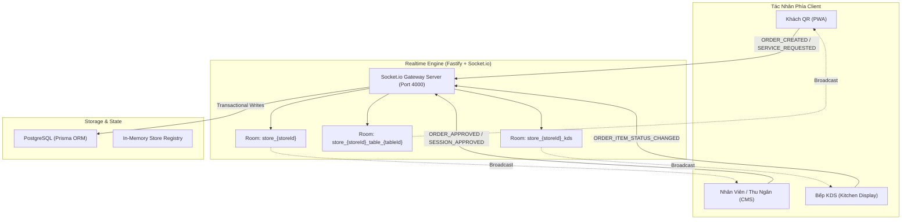

# KIẾN TRÚC ĐỒNG BỘ THỜI GIAN THỰC (REALTIME WEBSOCKET SPECIFICATION)

---

## 1. TỔNG QUAN KIẾN TRÚC & MỤC TIÊU VẬN HÀNH

Trong môi trường F&B (nhà hàng, quán cà phê, quán ăn), tính thời gian thực là sự sống còn của vận hành:
* Khi **Khách hàng** quét mã QR và gửi đơn món, **Thu ngân/Phục vụ** trên CMS phải nhận được thông báo chuông và thẻ đơn ngay tức thì (< 300ms).
* Khi **Thu ngân duyệt món**, màn hình **Bếp KDS** phải nhảy vé chế biến ngay lập tức.
* Khi **Bếp bấm xong món**, điện thoại của **Khách** và thiết bị cầm tay của **Phục vụ** phải cập nhật trạng thái "Đã lên bàn" kèm chuông rung.
* Khi **Mất kết nối mạng**, hệ thống phải tự động phục hồi kết nối (reconnect with exponential backoff) và đồng bộ lại trạng thái mà không gây trùng lặp đơn.



---

## 2. PHÂN TÁCH PHÒNG KẾT NỐI (ROOM ISOLATION & TENANCY)

Mọi kết nối WebSocket bắt buộc phải được gắn vào đúng tenant room để tránh rò rỉ dữ liệu giữa các cửa hàng.

### 2.1. Cấu trúc định danh Room
| Tên Room | Cấu trúc ID | Đối tượng tham gia | Mục đích dữ liệu |
| :--- | :--- | :--- | :--- |
| **Store Broadcast** | `store_{storeId}` | Toàn bộ nhân viên, thu ngân, quản lý của quán | Nhận thông báo chung, đơn mới, yêu cầu phục vụ, đóng ca. |
| **Table Channel** | `store_{storeId}_table_{tableId}` | Khách hàng quét mã QR tại bàn cụ thể | Nhận trạng thái mở bàn, trạng thái từng món, hóa đơn tạm tính. |
| **Kitchen KDS** | `store_{storeId}_kds` | Màn hình hiển thị bếp tại các quầy bar/bếp | Nhận vé món cần nấu, món làm lại khẩn cấp, lệnh ngừng nấu hủy món. |

### 2.2. Cơ chế Tham gia Room (Room Join Handshake)
```typescript
// Client kết nối và đăng ký room
import { getSocketClient } from "@/lib/socket";
import { SocketEvents } from "@a2order/shared";

const socket = getSocketClient();
socket.emit(SocketEvents.STORE_JOIN, { storeId: "store-bubble-tea" });

// Nếu là khách quét QR tại bàn:
socket.emit(SocketEvents.TABLE_JOIN, { 
  storeId: "store-bubble-tea", 
  tableId: "tb-01" 
});
```

---

## 3. DANH MỤC SỰ KIỆN CHUẨN HÓA (EVENT CATALOG)

Toàn bộ sự kiện được khai báo tập trung trong package `@a2order/shared` (`packages/shared/src/index.ts`) để đảm bảo type-safety 100% giữa Server và các Clients.

| Sự kiện (Event Name) | Nguồn gửi (Emitter) | Đối tượng nhận (Receiver) | Payload dữ liệu |
| :--- | :--- | :--- | :--- |
| `ORDER_CREATED` | Khách QR | POS Thu Ngân | `{ orderId, tableId, tableName, items, totalAmount }` |
| `ORDER_APPROVED` | Thu Ngân | Khách QR + Bếp KDS | `{ orderId, tableId, approvedAt, estimatedPrepMinutes }` |
| `ORDER_REJECTED` | Thu Ngân | Khách QR | `{ orderId, tableId, reason }` |
| `ORDER_ITEM_STATUS_CHANGED` | Bếp KDS / Thu Ngân | Khách QR + POS | `{ itemId, dishName, status: "COOKING" \| "SERVED" \| "CANCELLED" }` |
| `TABLE_SESSION_REQUESTED` | Khách QR | POS Thu Ngân | `{ tableId, tableName, guestCount, requestedAt }` |
| `TABLE_SESSION_APPROVED` | Thu Ngân | Khách QR | `{ tableId, sessionToken, openedAt }` |
| `SERVICE_REQUESTED` | Khách QR | POS Thu Ngân | `{ tableId, tableName, type: "Đá" \| "Khăn" \| "Dọn bàn", note }` |
| `SERVICE_COMPLETED` | Phục vụ | Khách QR | `{ requestId, tableId, completedAt }` |
| `PAYMENT_COMPLETED` | Thu Ngân | Khách QR | `{ tableId, totalAmount, paymentMethod, paidAt }` |

---

## 4. CHIẾN LƯỢC TỰ ĐỘNG PHỤC HỒI KẾT NỐI (RECONNECTION & BACKOFF)

1. **Heartbeat & Liveness**:
   * Ping interval: 25 giây.
   * Ping timeout: 10 giây.
   * Nếu quá 2 chu kỳ ping không nhận pong, client lập tức đánh dấu cờ `isOffline: true` trên thanh status bar của UI.
2. **Exponential Backoff Reconnect**:
   * Chu kỳ thử lại: 1s, 2s, 4s, 8s, tối đa 15s.
   * Khi kết nối lại thành công (`connect` event), client tự động gửi lại handshake `STORE_JOIN` và kích hoạt hàm `fetchLatestState()` để bù lấp dữ liệu bị miss trong thời gian ngắt kết nối (Missed Events Sync).
3. **Fallback Polling**:
   * Nếu WebSocket thất bại liên tục trong 30 giây (môi trường firewall chặn WS), client tự động chuyển sang cơ chế **HTTP Polling nhẹ (Smart Polling)** mỗi 10 giây một lần với header `If-Modified-Since`.

---

## 5. XỬ LÝ XUNG ĐỘT DỮ LIỆU & RACE CONDITIONS

* **Trường hợp 2 nhân viên cùng bấm duyệt 1 đơn**:
  * Backend áp dụng cơ chế **Optimistic Lock** hoặc trạng thái nguyên tử (`UPDATE orders SET status = 'APPROVED' WHERE id = :id AND status = 'PENDING'`).
  * Nhân viên bấm sau sẽ nhận phản hồi HTTP `409 Conflict: Đơn hàng đã được duyệt bởi nhân viên khác`, client tự động refresh danh sách thông báo.
* **Trường hợp khách đặt trùng do mạng chập chờn**:
  * Mỗi lần bấm "Xác Nhận Đặt Món", client sinh một `idempotencyKey` ngẫu nhiên dạng UUIDv4.
  * Server từ chối xử lý đơn mới nếu key đó đã được tiếp nhận trong vòng 60 giây.
