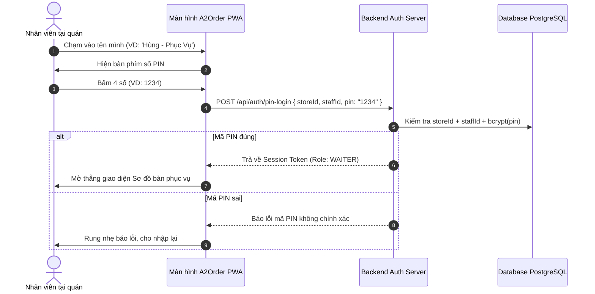

# F01 - ĐA THUÊ THUÊ & PHÂN QUYỀN NHÂN SỰ (MULTI-TENANCY & RBAC)

---

## 1. MỤC TIÊU & TÁC DỤNG (OBJECTIVE & VALUE)
* **Vấn đề thực tế của quán**:
  * Chủ quán sợ bị lộ doanh thu cho nhân viên biết.
  * Nhân viên bàn/bếp hay quên mật khẩu, không thể bắt họ đăng nhập email/mật khẩu phức tạp mỗi lần vào ca.
  * Bạn (Super Admin) cần quản lý từ xa hàng chục quán ăn mà không phải dựng server riêng cho từng quán.
* **Tác dụng mang lại**:
  * Cách ly dữ liệu 100% giữa các quán ăn.
  * Nhân viên đăng nhập siêu tốc bằng **Mã PIN 4 số** trong 1 giây.
  * Giám sát, kích hoạt hoặc khóa tài khoản quán ăn từ xa.

---

## 2. TÁC NHÂN THAM GIA & PHÂN QUYỀN (ACTORS & PERMISSIONS)

| Tác nhân | Quyền hạn trong tính năng | Giao diện sử dụng |
| :--- | :--- | :--- |
| **Super Admin (Bạn)** | Quản lý toàn bộ Store, xem danh sách, đổi trạng thái quán (`ACTIVE`/`SUSPENDED`). | Super Admin Portal (`/admin`) |
| **Chủ nhà hàng (Store Owner)** | Cài đặt thông tin quán, tạo tài khoản nhân viên, cấp mã PIN. | Owner Settings (`/settings/staff`) |
| **Nhân viên (Waiter, Cashier, Chef)** | Chọn tên mình trên màn hình và gõ mã PIN 4 số để vào ca. | Fast PIN Modal (`/login/pin`) |

---

## 3. QUY TRÌNH VẬN HÀNH (WORKFLOW & SEQUENCE)



---

## 4. MA TRẬN TÁC ĐỘNG & PHẠM VI ẢNH HƯỞNG (IMPACT ANALYSIS)

| Thành phần | Mức độ ảnh hưởng | Chi tiết tác động |
| :--- | :--- | :--- |
| **Toàn bộ hệ thống** | Tối cao | Là điều kiện tiên quyết (Gatekeeper) để truy cập mọi tính năng khác. |
| **Bảo mật cơ sở dữ liệu** | Tối cao | Mọi API sau đó đều trích xuất `storeId` từ Token đăng nhập. |
| **Màn hình ca kíp** | Cao | Cho phép bấm "Đổi ca" để khóa màn hình ngay khi hết giờ làm việc. |

---

## 5. THIẾT KẾ KỸ THUẬT & DỮ LIỆU (TECHNICAL SPECS)

### 5.1. API Endpoints
* `POST /api/auth/login-owner`: Đăng nhập Chủ quán bằng Email/Password $\rightarrow$ Cấp JWT Cookie HttpOnly.
* `POST /api/auth/login-pin`: Đăng nhập Nhân viên bằng mã PIN 4 số $\rightarrow$ Cấp Session Token nhẹ.
* `POST /api/admin/stores`: Super Admin tạo nhà hàng mới.

### 5.2. Schema Validation (Zod)
```typescript
import { z } from 'zod';

export const PinLoginSchema = z.object({
  storeId: z.string().uuid(),
  staffId: z.string().uuid(),
  pinCode: z.string().regex(/^\d{4}$/, "Mã PIN phải gồm đúng 4 chữ số"),
});
```

---

## 6. GÓC KHUẤT VẬN HÀNH & XỬ LÝ EDGE CASES

1. **Nhân viên nghỉ việc nhưng vẫn nhớ mã PIN**:
   * *Giải pháp*: Chủ quán chỉ cần 1 chạm chuyển trạng thái nhân viên đó thành `isActive: false` $\rightarrow$ Mã PIN lập tức bị vô hiệu hóa, phiên đăng nhập cũ bị kick ra ngay lập tức.
2. **Nhập sai mã PIN liên tục 5 lần**:
   * *Giải pháp*: Khóa tạm thời 5 phút để chống đoán mò mã PIN (Brute-force protection).
