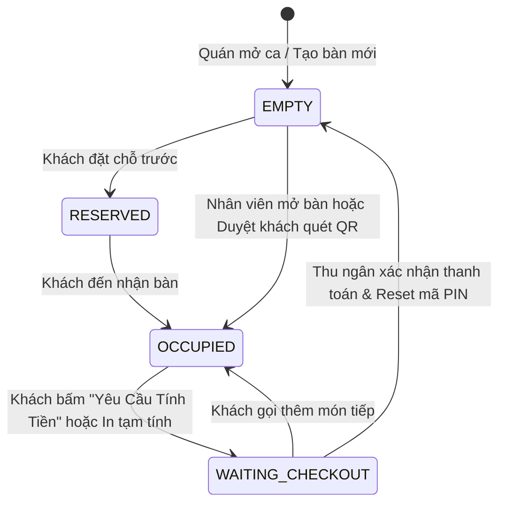

# F02 - QUẢN LÝ BÀN & MÃ BẢO MẬT PHIÊN BÀN (TABLE MANAGEMENT & SESSION SECURITY)

---

## 1. MỤC TIÊU & GIÁ TRỊ VẬN HÀNH (OBJECTIVE & VALUE)

* **Vấn đề thực tế của quán F&B**:
  * Khách chụp ảnh mã QR mang về nhà rồi từ xa đặt món ảo trêu đùa quán, khiến bếp nấu lãng phí thực phẩm.
  * Khách ngồi bàn này nhưng quét nhầm mã bàn bên cạnh, dẫn đến giao nhầm món và tính nhầm tiền.
  * Nhân viên không nắm được bàn nào ngồi bao lâu, bàn nào đang chờ thanh toán để dọn bàn đón lượt khách mới.
* **Giải pháp A2Order**:
  * **Mã PIN động 4 số theo phiên (Dynamic Session PIN)**: Mã PIN đổi mới tự động sau mỗi lượt khách. Chỉ người ngồi trực tiếp tại bàn mới có mã để gọi món.
  * **Cơ chế duyệt mở bàn 2 lớp**: Khách quét QR có thể bấm "Gọi nhân viên mở bàn", POS quầy duyệt mới mở menu.
  * **Sơ đồ bàn trực quan theo khu vực (Zones)**: Phân tầng (Tầng 1, Tầng 2, Ngoài trời, VIP), lọc nhanh bàn trống/đang phục vụ.

---

## 2. VÒNG ĐỜI TRẠNG THÁI BÀN (TABLE STATE LIFECYCLE)



### Chi tiết trạng thái:
| Mã trạng thái | Tên hiển thị | Màu nhận diện Donezo | Ý nghĩa vận hành |
| :--- | :--- | :--- | :--- |
| `EMPTY` | Bàn Trống | `bg-white border-surface-border text-ink-muted` | Bàn sẵn sàng đón khách mới, không có món nào chưa thanh toán. |
| `OCCUPIED` | Đang Phục Vụ | `bg-brand-50 border-brand-300 text-brand-900` | Khách đang ngồi, đã có món đang nấu hoặc đã phục vụ. |
| `WAITING_CHECKOUT` | Chờ Tính Tiền | `bg-amber-50 border-amber-300 text-amber-900` | Khách đã yêu cầu hóa đơn hoặc quầy đã in tạm tính, chờ thu tiền. |
| `RESERVED` | Đã Đặt Trước | `bg-cyan-50 border-cyan-300 text-cyan-900` | Bàn đã có khách đặt trước theo khung giờ, không nhận khách vãng lai. |

---

## 3. CƠ CHẾ BẢO MẬT MÃ PIN ĐỘNG (DYNAMIC PIN ROTATION)

1. **Khởi tạo**: Khi bàn ở trạng thái `EMPTY`, hệ thống sinh ngẫu nhiên mã PIN 4 chữ số (VD: `8492`) và lưu vào trường `currentPin` của bảng `Table`.
2. **Xác thực**:
   * Khách quét mã QR trên bàn sẽ chuyển hướng tới URL: `https://order.a2order.vn/?store=store-id&table=TB-01`.
   * Menu bị khóa ở trạng thái chờ mở bàn.
   * Khách có 2 lựa chọn:
     * Lựa chọn A: Bấm nút **"Gọi Nhân Viên Mở Bàn"** $\rightarrow$ Quầy POS nhận notification và bấm "Duyệt".
     * Lựa chọn B: Nhập trực tiếp **Mã PIN 4 số** in trên thẻ bàn $\rightarrow$ Mở menu ngay lập tức mà không cần nhân viên hỗ trợ.
3. **Đổi mã tự động (Auto-Rotate)**:
   * Ngay khi Thu ngân hoàn tất thanh toán và đóng bàn, hệ thống tự động sinh mã PIN ngẫu nhiên mới.
   * Mã PIN cũ lập tức vô hiệu hóa. Khách cũ chụp ảnh QR mang về nhà sẽ không thể nhập mã cũ để đặt món.

---

## 4. QUY TRÌNH CHUYỂN BÀN & GỘP BÀN (MOVE & MERGE)

* **Chuyển bàn (Move Table)**:
  * Khách muốn đổi từ Bàn 01 (nóng) sang Bàn 05 (mát hơn).
  * Nhân viên chọn Bàn 01 $\rightarrow$ Bấm "Chuyển / Ghép Bàn" $\rightarrow$ Chọn chế độ "Chuyển bàn" $\rightarrow$ Chọn Bàn 05 (Bàn trống).
  * Hệ thống chuyển toàn bộ danh sách món và hóa đơn sang Bàn 05, trả Bàn 01 về `EMPTY`.
* **Gộp bàn (Merge Table)**:
  * Hai nhóm bạn ngồi Bàn 02 và Bàn 03 muốn ngồi chung và thanh toán chung 1 bill.
  * Nhân viên chọn Bàn 02 $\rightarrow$ Bấm "Chuyển / Ghép Bàn" $\rightarrow$ Chọn chế độ "Gộp bàn" $\rightarrow$ Chọn Bàn 03.
  * Hệ thống dồn toàn bộ món của Bàn 02 sang Bàn 03, Bàn 02 trở về trạng thái trống.

---

## 5. THIẾT KẾ KỸ THUẬT & DỮ LIỆU (TECHNICAL SPECS)

### 5.1. API Endpoints
* `GET /api/stores/:storeId/tables`: Lấy danh sách toàn bộ bàn kèm trạng thái, số khách, số món và tiền tạm tính.
* `POST /api/stores/:storeId/tables/:tableId/session-request`: Khách gửi yêu cầu mở bàn.
* `POST /api/stores/:storeId/tables/:tableId/approve-session`: Thu ngân duyệt mở bàn.
* `POST /api/stores/:storeId/tables/:tableId/unlock-pin`: Khách mở bàn bằng mã PIN.
* `POST /api/stores/:storeId/tables/transfer`: Chuyển bàn hoặc gộp bàn.
* `POST /api/stores/:storeId/tables/:tableId/rotate-pin`: Đổi mã PIN mới thủ công từ POS.

### 5.2. Schema Validation (Zod)
```typescript
import { z } from 'zod';

export const UnlockTablePinSchema = z.object({
  storeId: z.string(),
  tableId: z.string(),
  pin: z.string().regex(/^\d{4}$/, "Mã PIN phải gồm đúng 4 chữ số"),
});

export const TransferTableSchema = z.object({
  storeId: z.string(),
  fromTableId: z.string(),
  toTableId: z.string(),
  mode: z.enum(["MOVE", "MERGE"]),
});
```
