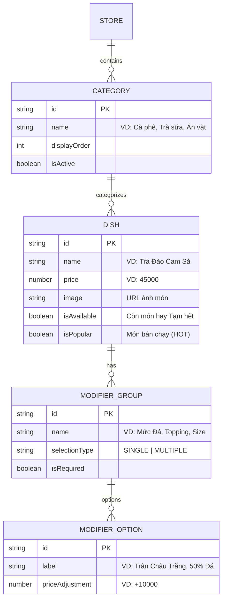

# F03 - QUẢN LÝ THỰC ĐƠN & TÙY CHỌN MÓN (MENU CATALOG & DISH MODIFIERS)

---

## 1. MỤC TIÊU & GIÁ TRỊ VẬN HÀNH (OBJECTIVE & VALUE)

* **Vấn đề thực tế của quán F&B**:
  * Quán trà sữa/cà phê có quá nhiều tùy biến: 50% đường, 70% đá, trân châu đen, thạch phô mai... Nhân viên ghi tay dễ nhầm lẫn.
  * Hết nguyên liệu đột xuất (hết sữa chua, hết kem cheese) nhưng không kịp thông báo, khách gọi món xong mới báo hết khiến khách khó chịu.
  * Menu giấy in ấn tốn kém, mỗi lần điều chỉnh giá hoặc thêm món mới phải in lại toàn bộ.
* **Giải pháp A2Order**:
  * **Thực đơn điện tử đa nền tảng**: Cập nhật giá, ảnh món và mô tả ngay tức thì trên điện thoại của khách và POS quầy.
  * **Nhóm tùy biến khẩu vị (Modifiers & Add-ons)**: Cho phép cấu hình topping, mức đường, mức đá, size ly, ghi chú riêng cho đầu bếp.
  * **Chốt chặn hết món 1 chạm (Instant Sold-out Toggle)**: Khi hết nguyên liệu, chỉ cần 1 chạm trên CMS là món tự động mờ đi và gắn nhãn "Tạm Hết", ngăn chặn khách đặt.

---

## 2. CẤU TRÚC DANH MỤC & MÓN ĂN (HIERARCHY & DATA MODEL)



---

## 3. QUY TRÌNH TÙY CHỈNH MÓN TRÊN GIAO DIỆN (USER FLOW)

1. **Khách hàng hoặc Nhân viên chọn món**:
   * Bấm vào món "Trà Sữa Oolong Nướng".
   * Modal tùy chỉnh mở ra:
     * *Chọn Size*: Size M (mặc định 0 đ) / Size L (+ 8.000 đ).
     * *Mức Đường*: 100% (Chuẩn), 70%, 50%, 30%, Không đường.
     * *Mức Đá*: Đầy đá, 70% đá, 50% đá, Đá riêng.
     * *Topping đi kèm*: Trân châu ô long (+ 6.000 đ), Pudding trứng (+ 8.000 đ).
     * *Ghi chú tự do*: *"Cho nhiều đá riêng giúp em"*.
2. **Tổng hợp giá tự động**:
   $$\text{Giá cuối} = \text{Giá gốc} + \sum \text{Phụ thu Topping} + \sum \text{Phụ thu Size}$$
3. **Hiển thị trực quan**: Trên phiếu bếp KDS và hóa đơn in ra, món được format rõ ràng:
   `1x Trà Sữa Oolong Nướng (Size L, 50% Đường, 50% Đá, + Trân châu ô long, Note: Cho nhiều đá riêng)`

---

## 4. QUẢN TRỊ BẢNG GIÁ & ĐỔI MÓN NHANH TẠI QUẦY (CMS MANAGEMENT)

* **Tìm kiếm & Phân loại thông minh**:
  * Thanh tìm kiếm tức thì theo tên món không dấu hoặc có dấu (hỗ trợ `removeAccents`).
  * Sắp xếp linh hoạt: Món bán chạy nhất (`POPULAR`), Giá tăng dần (`PRICE_ASC`), Giá giảm dần (`PRICE_DESC`).
* **Bật/Tắt Hết Hàng khẩn cấp**:
  * Khi bartender báo hết "Sữa chua dẻo", Thu ngân chỉ cần gạt switch "Còn món" $\rightarrow$ Khách quét QR thấy nút chuyển thành màu xám `Hết Món`.

---

## 5. THIẾT KẾ KỸ THUẬT & DỮ LIỆU (TECHNICAL SPECS)

### 5.1. API Endpoints
* `GET /api/stores/:storeId/menu`: Lấy toàn bộ thực đơn phân theo danh mục (hỗ trợ client caching ETag).
* `POST /api/stores/:storeId/menu/dishes`: Tạo món mới kèm bảng giá và ảnh.
* `PUT /api/stores/:storeId/menu/dishes/:dishId`: Sửa món ăn, giá bán và tùy biến.
* `PATCH /api/stores/:storeId/menu/dishes/:dishId/availability`: Chuyển trạng thái còn/hết món.

### 5.2. Schema Validation (Zod)
```typescript
import { z } from 'zod';

export const DishItemSchema = z.object({
  id: z.string().optional(),
  name: z.string().min(1, "Tên món không được để trống"),
  price: z.number().min(0, "Giá món phải >= 0"),
  categoryId: z.string().min(1, "Bắt buộc chọn danh mục"),
  image: z.string().url().optional().or(z.literal("")),
  isAvailable: z.boolean().default(true),
  isPopular: z.boolean().default(false),
  modifiers: z.array(z.string()).default([]),
});
```
