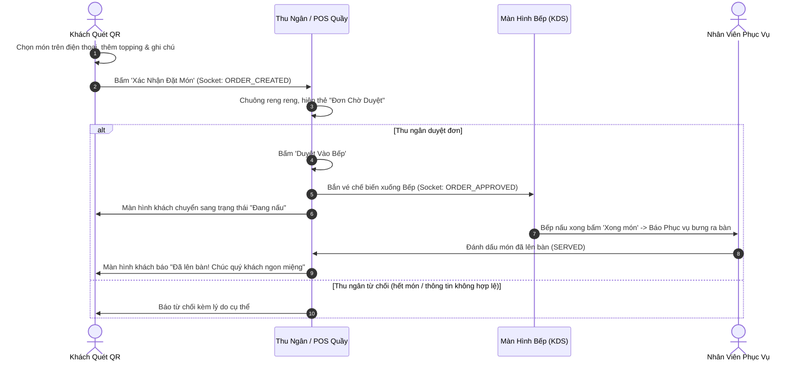

# F04 - GỌI MÓN ĐA KÊNH: NHÂN VIÊN & KHÁCH QUÉT QR (HYBRID ORDERING: WAITER & QR CODE)

---

## 1. MỤC TIÊU & GIÁ TRỊ VẬN HÀNH (OBJECTIVE & VALUE)

* **Vấn đề thực tế của quán F&B**:
  * Giờ cao điểm quán quá đông, khách vẫy tay gọi nhân viên nhưng nhân viên bận chạy không kịp tới, khách sốt ruột và bực bội.
  * Nhân viên ghi order ra giấy chữ xấu, bếp đọc nhầm thành món khác; hoặc nhân viên quên mang order vào quầy thu ngân.
  * Nhóm đi đông người, người đến trước gọi món trước, người đến sau muốn gọi thêm món bổ sung mà không muốn phải tính riêng thành đơn mới.
* **Giải pháp A2Order**:
  * **Mô hình Hybrid linh hoạt 2 trong 1**:
    1. *Khách tự gọi (Self-ordering via QR)*: Khách quét QR tại bàn, tự lướt menu, xem ảnh món và đặt hàng trên điện thoại cá nhân (không cần cài app).
    2. *Nhân viên gọi (Staff Handheld Ordering)*: Nhân viên cầm tablet/điện thoại di chuyển giữa các bàn để nhận món giúp khách lớn tuổi hoặc khách thanh toán tiền mặt.
  * **Hỗ trợ gọi món nhiều đợt (Multi-round Batches)**: Bàn có thể gửi vào bếp 3–4 đợt món khác nhau, toàn bộ dồn chung vào một hóa đơn duy nhất của bàn.
  * **Cổng duyệt 2 lớp an toàn (Approval Gate)**: Mọi món khách đặt qua QR đều chuyển thành thẻ "Chờ Duyệt" tại quầy thu ngân để kiểm tra trước khi bắn lệnh nấu xuống bếp.

---

## 2. QUY TRÌNH GỌI MÓN KẾT HỢP (HYBRID WORKFLOW)



---

## 3. CÁC TÍNH NĂNG VẬN HÀNH CHUYÊN SÂU TẠI BÀN

### 3.1. Gọi Món Nhiều Đợt (Multi-round Ordering)
* Đợt 1: Khách đến lúc 18:00 gọi 2 tô phở đặc biệt $\rightarrow$ Gửi bếp nấu.
* Đợt 2: Bạn khách đến lúc 18:15 gọi thêm 1 tô phở tái lăn + 2 ly trà đá $\rightarrow$ Gửi tiếp vào bếp.
* Hóa đơn bàn tự động tích lũy cả 2 đợt, hiển thị rõ thời gian từng món được gửi và trạng thái chế biến độc lập của từng món (`WAITING` $\rightarrow$ `COOKING` $\rightarrow$ `SERVED`).

### 3.2. Yêu Cầu Hỗ Trợ Nhanh Tại Bàn (Quick Service Requests)
Khách hàng không cần gọi to hay vẫy tay giữa quán. Trên màn hình gọi món có sẵn 6 nút hỗ trợ 1 chạm:
1. `cup` **Thêm đá lạnh**: Đem thêm xô hoặc ly đá.
2. `fileText` **Thêm khăn giấy**: Bổ sung hộp khăn giấy.
3. `refresh` **Dọn dẹp bàn**: Thu dọn vỏ chai, đĩa dư thừa.
4. `utensils` **Thêm chén đũa**: Thêm bát đĩa, muỗng đũa sạch.
5. `bell` **Gọi nhân viên**: Nhân viên trực tiếp tới bàn hỗ trợ.
6. `creditCard` **Yêu cầu tính tiền**: In phiếu tạm tính và mang bill tới bàn.

Khi bấm, POS quầy phát tín hiệu âm thanh và thẻ yêu cầu nhảy lên đầu danh sách kèm vị trí bàn.

---

## 4. QUY TRÌNH HỦY MÓN & NHẬT KÝ THẤT THOÁT (VOID AUDIT)

| Trạng thái món | Ai được phép hủy? | Ảnh hưởng hóa đơn | Hành động hệ thống |
| :--- | :--- | :--- | :--- |
| `WAITING` (Chờ duyệt) | Khách hàng hoặc Nhân viên | Trừ trực tiếp khỏi tiền bàn | Không ghi thất thoát vì bếp chưa nấu. |
| `COOKING` (Đang nấu) | Chỉ Thu ngân / Quản lý | Trừ tiền bàn | Bắn cảnh báo ngừng nấu tới Bếp KDS, ghi nhật ký Void Audit thất thoát nguyên liệu. |
| `SERVED` (Đã lên bàn) | Chỉ Thu ngân / Quản lý | Xử lý khiếu nại | Lựa chọn 1: **Làm lại món (Remake)** - miễn phí; Lựa chọn 2: **Trả món & Trừ tiền (Return)** - ghi nhật ký đền bù. |

---

## 5. THIẾT KẾ KỸ THUẬT & DỮ LIỆU (TECHNICAL SPECS)

### 5.1. API Endpoints
* `POST /api/orders`: Tạo đợt gọi món mới cho bàn (kèm `idempotencyKey`).
* `POST /api/orders/:orderId/approve`: Thu ngân duyệt đơn vào bếp.
* `POST /api/orders/:orderId/reject`: Thu ngân từ chối đơn.
* `POST /api/orders/service-request`: Gửi yêu cầu hỗ trợ nhanh.
* `POST /api/orders/items/:itemId/cancel`: Hủy món kèm lý do kiểm toán.

### 5.2. Schema Validation (Zod)
```typescript
import { z } from 'zod';

export const SubmitOrderSchema = z.object({
  storeId: z.string(),
  tableId: z.string(),
  idempotencyKey: z.string().uuid(),
  notes: z.string().optional(),
  items: z.array(
    z.object({
      dishId: z.string(),
      quantity: z.number().int().min(1),
      notes: z.string().optional(),
    })
  ).min(1, "Đơn hàng phải có ít nhất 1 món"),
});
```
