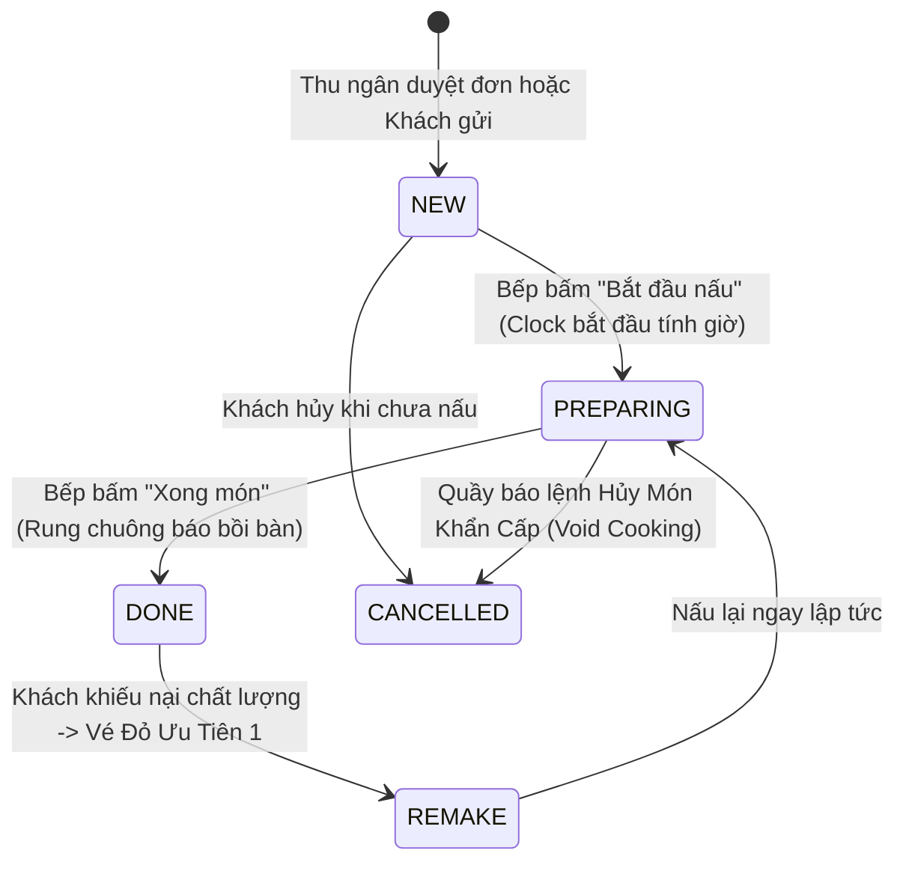

# F05 - MÀN HÌNH ĐIỀU PHỐI BẾP & PHA CHẾ (KITCHEN DISPLAY SYSTEM - KDS)

---

## 1. MỤC TIÊU & GIÁ TRỊ VẬN HÀNH (OBJECTIVE & VALUE)

* **Vấn đề thực tế trong khu vực Bếp / Bar**:
  * Giờ cao điểm, máy in nhiệt in ra hàng chục mét giấy, rơi xuống sàn ướt dầu mỡ, bay mất hoặc bị dính nước rách nát.
  * Đầu bếp không biết món nào vào trước, món nào vào sau, dẫn đến khách vào sau lại có đồ ăn trước, khách vào trước chờ 30 phút giận dữ bỏ về.
  * Khi khách đổi ý hủy món, nhân viên chạy vào bếp hét lên thì đầu bếp đã lỡ nấu xong, gây lãng phí nguyên liệu.
* **Giải pháp A2Order**:
  * **KDS Không Giấy (Paperless Kitchen Display)**: Thay thế hoàn toàn máy in bill bếp bằng tablet hoặc màn hình TV thông minh chống nước, chống bám dầu.
  * **Sắp xếp vé theo thời gian thực (FIFO - First In First Out)**: Tự động sắp xếp đơn theo thứ tự đặt, cảnh báo đổi màu theo thời gian chờ.
  * **Điều phối phân trạm thông minh (Station Routing)**: Tự động chia vé món nướng vào trạm Bếp Nóng, trà sữa/sinh tố vào quầy Bar Pha Chế.
  * **Chuông âm thanh báo động (Kitchen Chime Alert)**: Âm thanh vang rõ khi có đơn mới hoặc có lệnh "Làm lại món khẩn cấp".

---

## 2. QUY TRÌNH ĐIỀU PHỐI VÉ BẾP (KDS TICKET WORKFLOW)



---

## 3. CÁC TÍNH NĂNG VẬN HÀNH ĐẶC THÙ CHO BẾP

### 3.1. Cảnh Báo Màu Sắc Theo Thời Gian Chờ (Overdue Visual Cues)
Mỗi vé bếp hiển thị đồng hồ đếm ngược và tự động đổi màu viền để đầu bếp nhận biết ngay món nào sắp trễ hẹn với khách:
* 🟢 **Xanh lá (< 5 phút)**: Đơn mới vào, thời gian an toàn.
* 🟡 **Vàng hổ phách (5 – 12 phút)**: Đang nấu, cần đẩy nhanh tốc độ.
* 🔴 **Đỏ rực nhấp nháy (> 12 phút)**: Món bị trễ hạn (Overdue), ưu tiên đưa lên chảo/lò ngay lập tức.

### 3.2. Vé Ưu Tiên Làm Lại (Remake Emergency Tickets)
Khi khách khiếu nại món (VD: *"Phở có cọng tóc"*, *"Trà sữa chua bị thiu"*):
* Thu ngân bấm "Làm Lại Món" trên bàn của khách.
* Trên màn hình KDS xuất hiện vé viền đỏ đậm nhấp nháy, kèm huy hiệu **`🚨 LÀM LẠI KHẨN CẤP`** và lý do khiếu nại.
* Vé này tự động ghim lên vị trí số 1 của màn hình để đầu bếp làm ngay không cần xếp hàng.

### 3.3. Thông Báo Ngừng Nấu Tức Thì (Instant Stop Cooking Alert)
Khi Thu ngân xác nhận hủy món đang nấu (`Void Cooking`):
* Màn hình Bếp KDS phát âm thanh chuông cảnh báo 3 hồi ngắn.
* Thẻ món trên vé lập tức gạch ngang màu đỏ kèm nhãn **`ĐÃ HỦY - NGỪNG NẤU`** $\rightarrow$ Đầu bếp dừng tay ngay lập tức, tiết kiệm nguyên liệu thực phẩm.

---

## 4. PHÂN TRẠM CHẾ BIẾN (STATION ROUTING)

Hệ thống cho phép cấu hình thiết bị KDS theo trạm làm việc:
1. **Trạm Bếp Nóng (`KITCHEN_HOT`)**: Nhận các món cơm, phở, mì xào, món chiên/nướng.
2. **Trạm Bếp Lạnh (`KITCHEN_COLD`)**: Nhận salad, gỏi, đồ tráng miệng, trái cây.
3. **Trạm Quầy Bar (`BAR_STATION`)**: Nhận cà phê, trà sữa, sinh tố, nước ép, bia.
4. **Màn hình Tổng Bếp Trưởng (`EXPEDITER / EXPO`)**: Nhìn thấy toàn bộ các món từ mọi trạm để gom đủ đĩa trước khi giao cho nhân viên phục vụ bưng ra bàn.

---

## 5. THIẾT KẾ KỸ THUẬT & DỮ LIỆU (TECHNICAL SPECS)

### 5.1. Cấu trúc Vé KDS (`CmsKdsTicket`)
```typescript
export interface CmsKdsTicket {
  id: string;
  ticketCode: string;       // VD: "#TB01-ROUND1"
  tableName: string;        // VD: "Bàn 01 (Tầng 1)"
  orderTime: string;        // VD: "19:25"
  orderTimestamp: number;   // Epoch ms để tính timer
  status: "NEW" | "PREPARING" | "DONE" | "CANCELLED";
  station: "KITCHEN" | "BAR" | "ALL";
  waiterName?: string;
  priority?: "NORMAL" | "REMAKE" | "VIP";
  remakeReason?: string;
  items: Array<{
    dishName: string;
    quantity: number;
    notes?: string;
    isCanceled?: boolean;
  }>;
}
```

### 5.2. API Endpoints
* `GET /api/stores/:storeId/kds/tickets`: Lấy danh sách vé bếp đang hoạt động theo trạm.
* `PATCH /api/stores/:storeId/kds/tickets/:ticketId/status`: Đổi trạng thái vé (`PREPARING` / `DONE`).
* `PATCH /api/stores/:storeId/kds/items/:itemId/status`: Đánh dấu xong từng món lẻ trong vé.
