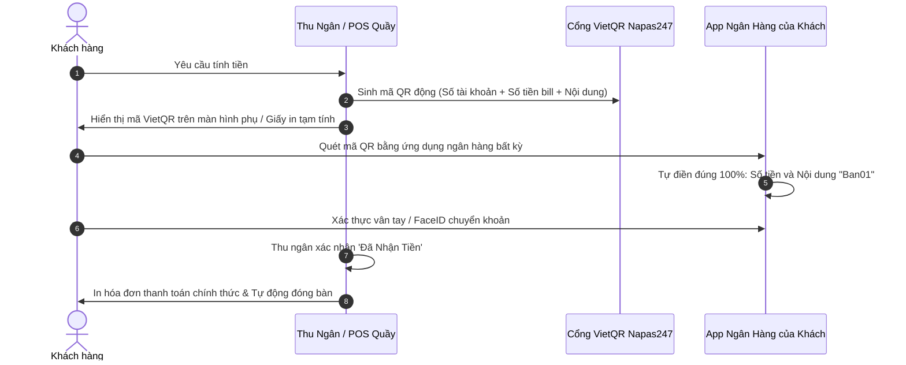

# F06 - TÍNH TIỀN, TÁCH BILL & THANH TOÁN VIETQR (BILLING, SPLIT-BILL & VIETQR ENGINE)

---

## 1. MỤC TIÊU & GIÁ TRỊ VẬN HÀNH (OBJECTIVE & VALUE)

* **Vấn đề thực tế khi thanh toán F&B**:
  * Nhóm bạn đi ăn uống đông người, muốn chia đều tiền hoặc có người phải về sớm muốn trả riêng phần của mình $\rightarrow$ Thu ngân lúng túng dùng máy tính bấm tay, dễ nhầm lẫn gây thất thoát.
  * Khách quét mã QR chuyển khoản nhưng gõ sai số tiền hoặc quên ghi nội dung chuyển khoản $\rightarrow$ Kế toán cuối ngày mất hàng giờ đối soát sao kê ngân hàng.
  * Quán muốn tính thêm phụ thu phòng lạnh, phụ thu lễ tết hoặc giảm giá 10% xin lỗi vì đồ ăn ra chậm mà không có quy chuẩn ghi nhận vào hóa đơn.
* **Giải pháp A2Order**:
  * **Mã Động VietQR Napas 247 Chuẩn Quốc Gia**: Tự động mã hóa chính xác số tiền cần trả và cú pháp chuyển khoản vào ảnh QR. Khách chỉ cần mở App ngân hàng quét là chuyển đúng 100%, không cần gõ số tiền hay nội dung.
  * **Bộ Công Cụ Tách Bill Thông Minh (Dual-mode Split Bill)**:
    1. *Tách Theo Từng Món (Itemized Split)*: Tách món của người về trước sang Hóa đơn B, giữ lại Hóa đơn A cho bàn tiếp tục dùng bữa.
    2. *Chia Đều Đầu Người (Equal Split)*: Chia đều bill cho 2, 3, 4, 5, 6... người, sinh riêng mã QR cho từng người quét và theo dõi checklist ai đã trả.
  * **Hệ thống Phụ Thu & Giảm Giá Chặt Chẽ (Surcharges & Discounts)**: Kiểm soát chiết khấu có lý do giải trình, chống thất thoát tiền mặt.

---

## 2. QUY TRÌNH THANH TOÁN VIETQR ĐỘNG (DYNAMIC VIETQR FLOW)



### Cấu trúc URL ảnh VietQR chuẩn Napas:
$$\text{https://img.vietqr.io/image/}\langle\text{BankBin}\rangle\text{-}\langle\text{AccountNo}\rangle\text{-compact2.png?amount=}\langle\text{Amount}\rangle\text{\&addInfo=}\langle\text{Note}\rangle$$
* Ví dụ thực tế: `https://img.vietqr.io/image/970422-0903111222-compact2.png?amount=185000&addInfo=Ban01_A2Order`

---

## 3. CÔNG NGHỆ TÁCH BILL 2 CHẾ ĐỘ (SPLIT-BILL ENGINE)

### 3.1. Chế độ 1: Tách Theo Từng Món (Itemized Split)
* Dành cho trường hợp một hoặc vài người trong bàn muốn về trước và trả tiền phần của họ:
* Thu ngân mở modal **"Tách Hóa Đơn"** $\rightarrow$ Chọn tab "Tách Theo Món (Bill B)".
* Bấm tăng số lượng món cần tách:
  * Ví dụ: Bàn có 3 ly Cà phê muối, khách A về trước trả 1 ly $\rightarrow$ Chọn tách 1 ly sang Bill B.
* Hệ thống hiển thị bảng so sánh 2 Bill tức thì:
  * **Bill A (Còn lại bàn)**: Giữ lại trên bàn để phục vụ tiếp.
  * **Bill B (Tách ra thanh toán)**: Sinh mã QR riêng và in phiếu thu cho khách về trước.

### 3.2. Chế độ 2: Chia Đều Đầu Người (Equal Split)
* Dành cho nhóm bạn/đồng nghiệp "Campuchia" chia đều tiền:
* Chọn số người chia (2, 3, 4, 5, 6, 8, 10 người).
* Hệ thống tính số tiền mỗi người:
  $$\text{Tiền mỗi người} = \left\lceil \frac{\text{Tổng tiền hóa đơn}}{\text{Số người chia}} \right\rceil$$
* Mỗi người có 1 thẻ riêng gồm:
  * Nút **"Mã QR"**: Hiện mã VietQR đúng số tiền phần người đó cần chuyển.
  * Nút **"Thu Tiền"**: Đổi sang màu xanh "Đã Thu" khi người đó chuyển khoản xong.
* Thanh tiến độ đếm số người đã thanh toán (VD: `3/4 người đã thanh toán`). Khi đủ 4/4 người, nút "Hoàn Tất Thu Tiền" kích hoạt để đóng bàn.

---

## 4. QUẢN LÝ PHỤ THU & GIẢM GIÁ (SURCHARGES & DISCOUNTS)

Để triệt tiêu tình trạng nhân viên tự ý giảm giá cho người quen hoặc ăn bớt tiền phụ thu:
* **Phụ thu dịch vụ (+ đ)**:
  * Phụ thu phòng VIP, phí đem đồ uống ngoài vào, phụ thu đêm muộn, phụ thu ngày lễ.
  * Hiển thị thành một dòng cộng tiền minh bạch trên hóa đơn.
* **Giảm giá / Đền bù (- đ)**:
  * Hỗ trợ giảm theo `%` (5%, 10%, 15%, 20%) hoặc giảm theo `Số tiền cụ thể` (20.000 đ, 50.000 đ).
  * **Bắt buộc nhập lý do**: *"Khách thân thiết VIP"*, *"Món lên chậm > 25 phút xin lỗi khách"*, *"Voucher thẻ thành viên"*.
  * Toàn bộ khoản giảm giá được ghi lại vào báo cáo doanh thu để Chủ quán kiểm tra.

---

## 5. THIẾT KẾ KỸ THUẬT & DỮ LIỆU (TECHNICAL SPECS)

### 5.1. Cấu trúc Hóa đơn (`OrderReceipt`)
```typescript
export interface OrderReceipt {
  receiptId: string;
  orderCode: string;
  tableId: string;
  tableName: string;
  openedAt: string;
  closedAt: string;
  cashierName: string;
  items: Array<{
    name: string;
    quantity: number;
    price: number;
    amount: number;
  }>;
  subTotal: number;
  surcharges: Array<{ name: string; amount: number }>;
  discount: { type: "PERCENT" | "AMOUNT"; value: number; amount: number; reason: string } | null;
  finalAmount: number;
  paymentMethod: "CASH" | "VIETQR" | "CARD";
}
```

### 5.2. API Endpoints
* `POST /api/stores/:storeId/orders/:orderId/checkout`: Thanh toán hóa đơn bàn.
* `POST /api/stores/:storeId/orders/:orderId/split-itemized`: Thực hiện tách món sang Bill B.
* `POST /api/stores/:storeId/orders/:orderId/surcharges`: Thêm phụ thu vào bàn.
* `POST /api/stores/:storeId/orders/:orderId/discounts`: Áp dụng giảm giá vào bàn.
* `GET /api/stores/:storeId/orders/:orderId/print-bill`: Lấy định dạng in nhiệt ESC/POS của hóa đơn.
