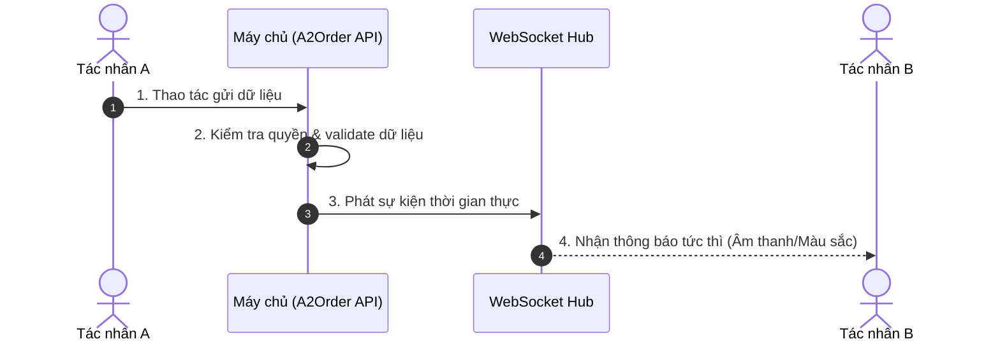

# [MÃ TÍNH NĂNG] - [TÊN TÍNH NĂNG]
> *Ví dụ: `F04 - GỌI MÓN PHỤC VỤ & KHÁCH QUÉT QR (HYBRID ORDERING)`*

---

## 1. MỤC TIÊU & TÁC DỤNG (OBJECTIVE & VALUE)
* **Vấn đề thực tế của quán**: *Mô tả ngắn gọn nỗi đau thực tế tại quán ăn mà tính năng này giải quyết.*
* **Tác dụng mang lại**: *Giảm bao nhiêu % thời gian, hạn chế sai sót gì, tiết kiệm chi phí/nhân lực ra sao?*

---

## 2. TÁC NHÂN THAM GIA & PHÂN QUYỀN (ACTORS & PERMISSIONS)

| Tác nhân | Vai trò trong tính năng | Quyền hạn yêu cầu | Giao diện sử dụng |
| :--- | :--- | :--- | :--- |
| **Phục vụ (Waiter)** | Chọn món cho khách, ghi chú đặc biệt | `ORDER_CREATE`, `ORDER_EDIT` | Mobile Waiter App |
| **Khách hàng** | Tự quét QR tại bàn, chọn món vào giỏ | Không cần đăng nhập (Session QR) | Customer Mobile Web |
| **Đầu bếp (Chef)** | Nhận thông báo món mới để nấu | `KDS_VIEW` | Tablet KDS Bếp |
| **Thu ngân / Chủ quán** | Giám sát đơn, duyệt (nếu có) | `STORE_OWNER`, `CASHIER` | Web Thu ngân |

---

## 3. QUY TRÌNH VẬN HÀNH (WORKFLOW & SEQUENCE)

### 3.1. Các bước thực hiện tuần tự:
1. **Bước 1**: ...
2. **Bước 2**: ...
3. **Bước 3**: ...

### 3.2. Sơ đồ tuần tự (Mermaid Sequence Diagram):


---

## 4. MA TRẬN TÁC ĐỘNG & PHẠM VI ẢNH HƯỞNG (IMPACT ANALYSIS)

Bất kỳ thay đổi nào cũng có tác động dây chuyền, hãy liệt kê rõ:

| Thành phần | Mức độ ảnh hưởng | Chi tiết tác động |
| :--- | :--- | :--- |
| **Sơ đồ bàn (Table Map)** | Cao / Trung bình / Thấp | Đổi màu bàn sang màu Cam (Đang chờ món), bắt đầu đếm giờ. |
| **Màn hình Bếp (KDS)** | Cao | Xuất hiện thẻ món mới, phát chuông báo, phân loại món theo nhóm. |
| **Màn hình Thu ngân** | Trung bình | Hóa đơn tạm tính của bàn tự động tăng tổng tiền. |
| **Cơ sở dữ liệu** | Có thay đổi | Thêm bản ghi vào bảng `OrderSession`, `OrderItem`. |
| **Bảo mật & Phân quyền** | Không | Không thay đổi cơ chế RBAC. |

---

## 5. THIẾT KẾ KỸ THUẬT & DỮ LIỆU (TECHNICAL SPECS)

### 5.1. Thay đổi Cơ sở dữ liệu (Database Schema)
```prisma
// Khai báo model Prisma (nếu có thêm trường/bảng mới)
model Example {
  id        String   @id @default(uuid())
  storeId   String   // BẮT BUỘC: Multi-tenant
  ...
}
```

### 5.2. API Contracts & Zod Schema
* **Endpoint**: `POST /api/orders`
* **Request Payload**:
```json
{
  "tableId": "table_123",
  "items": [
    { "menuItemId": "item_abc", "quantity": 2, "notes": "Ít ngọt, đá riêng" }
  ]
}
```
* **Response Output**:
```json
{
  "success": true,
  "orderId": "order_789",
  "totalEstimated": 90000
}
```

### 5.3. Sự kiện Real-time (WebSocket Events)
* **Tên sự kiện**: `ORDER_SUBMITTED`
* **Payload**: `{ storeId, tableId, tableName, items, timestamp }`
* **Kênh phát**: `room:store_${storeId}`

---

## 6. GÓC KHUẤT VẬN HÀNH & XỬ LÝ EDGE CASES (OPERATIONAL EDGE CASES)

1. **Khách bấm gửi liên tục 5 lần (Spam submit)**:
   * *Giải pháp*: Debounce nút bấm trên UI + Idempotency Key ở Backend.
2. **Bếp vừa hết món đúng lúc khách đang bấm chọn**:
   * *Giải pháp*: Server kiểm tra trường `isAvailable` trước khi chốt đơn; nếu hết báo ngay: *"Món X vừa hết nguyên liệu, vui lòng chọn món khác"*.
3. **Mất kết nối mạng tạm thời (Wifi rớt)**:
   * *Giải pháp*: Lưu vào hàng đợi Offline (IndexedDB trên PWA), tự động gửi lại khi có mạng.

---

## 7. KỊCH BẢN KIỂM THỬ (TEST & VERIFICATION CASES)

- [ ] **Case 1**: Thao tác thành công đúng quy chuẩn (Happy Path).
- [ ] **Case 2**: Kiểm tra cô lập dữ liệu: Quán B không thể nhìn thấy đơn của Quán A.
- [ ] **Case 3**: Kiểm tra tốc độ real-time: Bếp nhận được đơn dưới 200ms.
- [ ] **Case 4**: Kiểm tra trường hợp sai quyền (Ví dụ: Phục vụ cố tình gọi API xóa món).

---

## 8. HƯỚNG DẪN DÀNH CHO KHÁCH HÀNG (CUSTOMER USER MANUAL SNIPPET)
*Viết hướng dẫn ngắn gọn 3 dòng kèm ảnh chụp/icon để copy vào file Hướng dẫn Khách hàng (`docs/03-user-guides/`)*:
* **Bước 1**: ...
* **Bước 2**: ...
* **Bước 3**: ...
