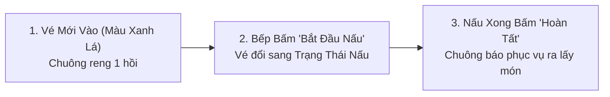

# HƯỚNG DẪN SỬ DỤNG: DÀNH CHO BẾP & QUẦY BAR (KITCHEN DISPLAY - KDS GUIDE)

---

## 1. GIỚI THIỆU GIAO DIỆN BẾP KHÔNG GIẤY (KDS OVERVIEW)

Màn hình Bếp KDS được thiết kế với giao diện tương phản cao, phông chữ to rõ để đầu bếp và bartender có thể nhìn rõ từ khoảng cách 2 – 3 mét trong môi trường khói lửa, dầu mỡ và thiếu sáng:
* **Mỗi vé (Ticket) đại diện cho 1 lượt đặt của 1 bàn**: Gồm số bàn, thời gian đặt, danh sách món kèm ghi chú chi tiết.
* **Thanh tổng hợp món (Item Aggregation Bar)**: Hiển thị tổng số lượng món cần làm cùng lúc (VD: `Tổng: 5 Phở bò, 3 Trà đào`) giúp đầu bếp nấu theo mẻ tiết kiệm thời gian.
* **Chuông báo âm thanh (Kitchen Bell)**: Kêu to mỗi khi có vé mới vào hoặc có lệnh thay đổi khẩn cấp.

---

## 2. QUY TRÌNH THAO TÁC NẤU & RA MÓN

### 2.1. Nhận Biết Vé Theo Màu Sắc & Thời Gian Chờ
* 🟢 **Vé Viền Xanh (Dưới 5 phút)**: Vé mới vào ca, thời gian xử lý bình thường.
* 🟡 **Vé Viền Vàng (5 – 12 phút)**: Đang nấu, đồng hồ đếm phút hiển thị rõ để đầu bếp chú ý tiến độ.
* 🔴 **Vé Viền Đỏ Rực (> 12 phút)**: Vé bị chậm trễ, bắt buộc đầu bếp ưu tiên đưa lên bếp gấp để tránh khách phàn nàn.

### 2.2. Thao Tác Bấm Trên Màn Hình
1. **Nấu từng món**: Khi nấu xong món nào trong vé, có thể chạm trực tiếp vào dòng món đó để gạch ngang xong món.
2. **Xong toàn bộ vé**: Khi toàn bộ món trong vé đã làm xong và bày lên đĩa, bấm nút to **"HOÀN TẤT VÉ"** ở chân thẻ.
   * Thẻ biến mất khỏi màn hình chờ và chuyển sang lịch sử đã xong.
   * Hệ thống tự động báo cho nhân viên phục vụ chạy bàn tới lấy món.

---

## 3. XỬ LÝ CÁC TÌNH HUỐNG KHẨN CẤP TRONG CA

### 3.1. Nhận Lệnh "Làm Lại Món Khẩn Cấp" (Remake Ticket)
* Khi khách khiếu nại (món nguội, có vật thể lạ, làm sai độ ngọt), thu ngân sẽ bắn vé Remake:
* Màn hình bếp sẽ phát **chuông cảnh báo dồn dập**.
* Vé viền đỏ đậm nhấp nháy mang tiêu đề: **`🚨 LÀM LẠI KHẨN CẤP`** kèm lý do giải thích (VD: *"Khách báo ít ngọt làm lại"*).
* Vé này được ưu tiên số 1, đầu bếp phải thực hiện ngay lập tức không để khách chờ thêm.

### 3.2. Nhận Lệnh "Ngừng Nấu - Khách Hủy Món" (Void Cooking Alert)
* Khi khách đợi lâu hoặc đổi ý hủy món:
* Màn hình KDS phát tiếng bíp ngắt quãng.
* Món bị hủy trên vé sẽ bị **gạch ngang đỏ** và hiện nhãn **`ĐÃ HỦY - NGỪNG NẤU`**.
* Đầu bếp lập tức dừng chế biến món đó để giữ lại nguyên liệu thực phẩm.

---

## 4. CHUYỂN ĐỔI TRẠM LÀM VIỆC (STATION SWITCHING)

Ở góc trên màn hình, đầu bếp/bartender có thể lọc nhanh theo trạm:
* **TẤT CẢ**: Dành cho Bếp trưởng hoặc quán nhỏ 1 trạm.
* **BẾP NÓNG**: Chỉ hiển thị các món xào, nấu, chiên, nướng.
* **QUẦY BAR**: Chỉ hiển thị đồ uống, cà phê, trà sữa, tráng miệng.

---

## 5. BẢO QUẢN THIẾT BỊ MÀN HÌNH BẾP

1. Thiết bị KDS nên được gắn trên giá treo tường (VESA mount) cách xa nguồn nhiệt trực tiếp hoặc bồn rửa nước.
2. Cuối ngày dùng khăn mềm ẩm lau sạch dầu mỡ trên bề mặt kính cảm ứng.
3. Không dùng vật sắc nhọn để bấm màn hình.
