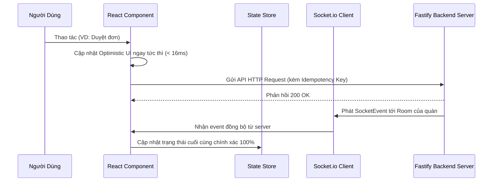

# HƯỚNG DẪN LẬP TRÌNH & TIÊU CHUẨN KIẾN TRÚC CHO AI & KỸ SƯ PHẦN MỀM
# (A2ORDER AI DEVELOPMENT & ENGINEERING GUIDE)

---

## 1. TỔNG QUAN HỆ THỐNG & NGUYÊN TẮC THIẾT KẾ CỐT LÕI

Dự án **A2Order** là nền tảng quản lý vận hành và gọi món thông minh chuẩn SaaS dành cho ngành F&B (Nhà hàng, Quán cà phê, Quán ăn). Hệ thống được xây dựng dưới dạng **Monorepo (npm workspaces)** với kiến trúc phân tách rõ ràng:

```
A2Order/
├── apps/
│   ├── cms/          # Hệ thống Quản trị & POS Thu ngân (Vite + React + TailwindCSS)
│   ├── client/       # Ứng dụng PWA dành cho Khách hàng quét mã QR (Vite + React)
│   └── server/       # Backend RESTful API & Realtime Socket Gateway (Fastify + Prisma)
├── packages/
│   └── shared/       # Shared TypeScript Types, Enums, Socket Events & Constants
└── docs/             # Toàn bộ tài liệu kỹ thuật, nghiệp vụ và hướng dẫn sử dụng
```

### 4 Trụ Cột Triết Lý Kỹ Thuật (Engineering Pillars):
1. **Zero-Ambiguity Types**: 100% dữ liệu trao đổi giữa Client và Server được định kiểu bằng TypeScript và schema validation qua Zod.
2. **Resilience & Offline-First**: Mọi luồng quan trọng (đặc biệt là thanh toán và phiếu bàn) phải hoạt động được khi rớt mạng hoặc mất điện.
3. **Strict Donezo Forest Green Design System**: Giao diện chuẩn mực, đồng nhất, tinh tế, không tự ý sáng tạo mã màu hoặc icon lạ.
4. **Clean Decoupled Architecture**: Không được viết các file component khổng lồ "God Component" (> 500 dòng). Bắt buộc tách nhỏ theo phân vùng (Sections) và hộp thoại (Modals).

---

## 2. BỘ QUY TẮC BẮT BUỘC KHI LẬP TRÌNH (AGENT GUIDELINES COMPLIANCE)

Mọi AI Agent và Kỹ sư phần mềm khi làm việc trên codebase A2Order **BẮT BUỘC TUÂN THỦ 10 QUY TẮC SAU**:

### Quy tắc 1: Chuẩn hóa Bảng màu Donezo Forest Green
* Tuyệt đối không dùng các màu tùy tiện như `bg-emerald-600`, `bg-blue-600`, `bg-green-500` hoặc mã màu hex tùy tiện (`#10b981`).
* Bắt buộc sử dụng các Semantic Tokens đã được định nghĩa trong `tailwind.config.js`:
  * Màu thương hiệu chính: `bg-brand-900` (#0D3829), `hover:bg-brand-800` (#134E3A), `text-brand-900`.
  * Màu nền nhấn nhẹ: `bg-brand-50` (#E8F2ED), `border-brand-200` (#A8D5BA).
  * Màu nền canvas & bề mặt: `bg-surface-canvas` (#F4F7F5), `bg-surface-card` (#FFFFFF), `border-surface-border` (#E2E8F0).
  * Màu chữ: `text-ink-primary` (#0F172A), `text-ink-secondary` (#334155), `text-ink-muted` (#64748B).
  * Màu cảnh báo: `bg-amber-50 text-amber-900 border-amber-300`, `bg-rose-50 text-rose-700 border-rose-200`.

### Quy tắc 2: Cấm Tuyệt Đối Dùng Emoji trong Code & Giao Diện
* Không được đặt emoji (ví dụ: `🍺`, `🍜`, `🔔`, `⏳`) trong chuỗi thông báo, giao diện hay code.
* Bắt buộc sử dụng component icon chuẩn hóa: `<Icon name="..." size={...} className="..." />`.
* Toàn bộ danh mục icon hợp lệ nằm trong `apps/cms/src/types/icon.types.ts` (dựa trên Lucide Icons).

### Quy tắc 3: Cấm Khai Báo Interface / Type Bừa Bãi Trong File Component
* **Không được** khai báo các interface nghiệp vụ (`interface MenuItem`, `interface OrderItem`, `interface TableOrder`) trực tiếp bên trong component view.
* Mọi kiểu dữ liệu dùng chung phải đặt tại:
  * Kiểu dữ liệu chia sẻ toàn hệ thống: `packages/shared/src/index.ts`.
  * Kiểu dữ liệu nghiệp vụ CMS: `apps/cms/src/types/cms.types.ts`.
  * Kiểu dữ liệu bếp: `apps/cms/src/types/kds.types.ts`.
* File component chỉ được phép khai báo duy nhất `interface [ComponentName]Props`.

### Quy tắc 4: Giới Hạn Chiều Dài File & Bóc Tách Module
* Mọi file component vượt quá **500 dòng** phải được rà soát và tái cấu trúc ngay lập tức.
* Cấu trúc thư mục chuẩn khi bóc tách một màn hình lớn:
  ```
  features/[domain]/
  ├── [Domain]View.tsx          # Orchestrator chính (< 500 dòng)
  ├── components/
  │   ├── modals/               # Toàn bộ modal độc lập
  │   │   ├── [Action]Modal.tsx
  │   │   └── index.ts
  │   ├── sections/             # Các phân vùng giao diện lớn
  │   │   ├── [Area]Section.tsx
  │   │   └── index.ts
  │   └── index.ts
  ```

### Quy tắc 5: Thông Báo & Hộp Thoại Chuẩn
* **Tuyệt đối không dùng** `alert()` hoặc `confirm()` mặc định của trình duyệt vì gây gián đoạn luồng người dùng và xấu giao diện.
* Luôn sử dụng notification store:
  ```typescript
  import { toast, confirmDialog } from "@/stores/notificationStore";

  // Thông báo nhanh
  toast.success("Đã gửi đơn vào bếp thành công!");
  toast.error("Không thể kết nối máy chủ!");

  // Hộp thoại xác nhận bất đồng bộ
  const ok = await confirmDialog({
    title: "Xác nhận hủy món?",
    message: "Món đã nấu, hủy sẽ ghi nhận thất thoát.",
    confirmText: "Hủy Món Ngay",
    variant: "danger",
  });
  if (!ok) return;
  ```

---

## 3. QUẢN LÝ TRẠNG THÁI & REALTIME DATA SYNC

### 3.1. Luồng Dữ Liệu Hai Chiều (Bi-directional Data Flow)
Hệ thống sử dụng kết hợp giữa **Local React State / Hooks** và **WebSocket Event Bus**:



### 3.2. Chống Trùng Lặp Thao Tác (Idempotency Key)
Mọi thao tác tạo đơn hoặc thanh toán đều phải sinh `idempotencyKey` ngẫu nhiên dạng UUIDv4 trước khi gửi request. Nếu mạng chập chờn gửi lại 2 lần, Server tự động nhận diện và trả về kết quả của lượt đầu tiên mà không tạo 2 đơn trùng nhau.

---

## 4. CHIẾN LƯỢC KIỂM THỬ & BUILD VERIFICATION

Trước khi kết thúc bất kỳ lượt phát triển nào, AI Agent bắt buộc phải thực hiện các bước xác thực sau trong môi trường terminal:

1. **Kiểm tra biên dịch tĩnh TypeScript (Zero TS Errors)**:
   ```powershell
   npx tsc --noEmit --project apps/cms/tsconfig.json
   npx tsc --noEmit --project apps/client/tsconfig.json
   npx tsc --noEmit --project apps/server/tsconfig.json
   ```
2. **Kiểm tra Vite Production Build**:
   ```powershell
   npm run build --workspace=@a2order/cms
   npm run build --workspace=@a2order/client
   ```
3. **Kiểm tra Linter & Code Style**:
   * Đảm bảo không còn `console.log` rác hoặc biến `any` không được kiểm soát.

---

## 5. CÁC ANTI-PATTERNS CẦN TRÁNH TUYỆT ĐỐI (WHAT NOT TO DO)

1. ❌ **Anti-pattern 1: Sáng tạo thêm icon SVG inline** thay vì dùng `<Icon name="..." />`.
2. ❌ **Anti-pattern 2: Gộp toàn bộ modal vào cùng 1 file** khiến file phình to lên hàng nghìn dòng.
3. ❌ **Anti-pattern 3: Sử dụng `localStorage` trực tiếp mà không bọc `try/catch`** $\rightarrow$ Dễ gây crash ứng dụng trên Safari Private Browsing hoặc khi đầy bộ nhớ thiết bị.
4. ❌ **Anti-pattern 4: Không quản lý cleanup listener của Socket.io trong `useEffect`** $\rightarrow$ Gây rò rỉ bộ nhớ (Memory Leak) và kích hoạt sự kiện nhiều lần.
