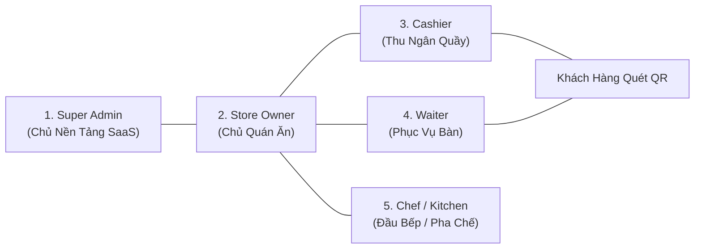
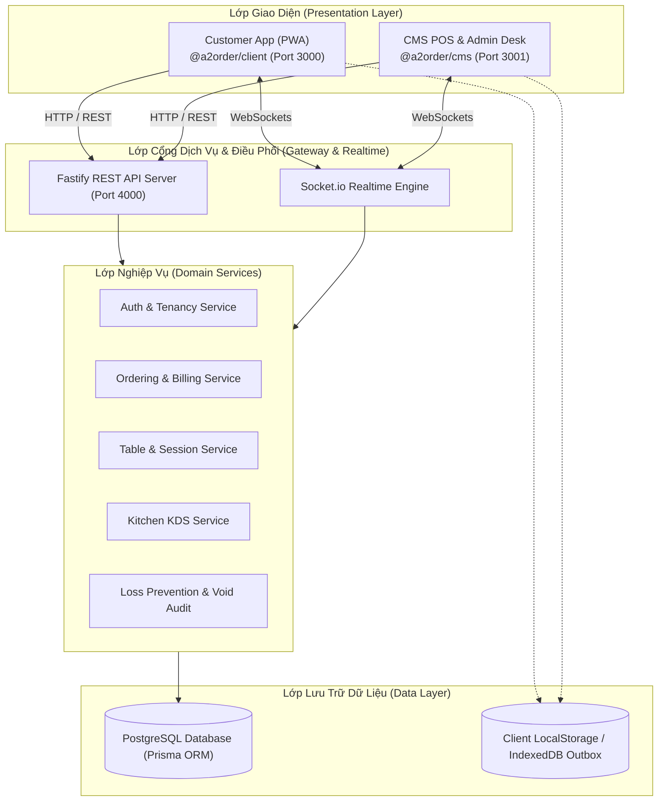

# BÁO CÁO ĐỒ ÁN / TÀI LIỆU NGHIỆM THU DỰ ÁN
# HỆ THỐNG QUẢN LÝ VẬN HÀNH & GỌI MÓN THÔNG MINH CHO NGÀNH F&B (A2ORDER)

---

## MỤC LỤC

1. [CHƯƠNG 1: ĐẶT VẤN ĐỀ & BỐI CẢNH DỰ ÁN](#chương-1-đặt-vấn-đề--bối-cảnh-dự-án)
2. [CHƯƠNG 2: PHÂN TÍCH NGHIỆP VỤ & CHÂN DUNG NGƯỜI DÙNG](#chương-2-phân-tích-nghiệp-vụ--chân-dung-người-dùng)
3. [CHƯƠNG 3: KIẾN TRÚC PHẦN MỀM & THIẾT KẾ HỆ THỐNG](#chương-3-kiến-trúc-phần-mềm--thiết-kế-hệ-thống)
4. [CHƯƠNG 4: HIỆN THỰC HÓA CÁC TÍNH NĂNG CỐT LÕI](#chương-4-hiện-thực-hóa-các-tính-năng-cốt-lõi)
5. [CHƯƠNG 5: BẢO MẬT, TỐI ƯU HIỆU NĂNG & CHỐNG THẤT THOÁT](#chương-5-bảo-mật-tối-ưu-hiệu-năng--chống-thất-thoát)
6. [CHƯƠNG 6: KẾT QUẢ NGHIỆM THU & HƯỚNG PHÁT TRIỂN](#chương-6-kết-quả-nghiệm-thu--hướng-phát-triển)

---

## CHƯƠNG 1: ĐẶT VẤN ĐỀ & BỐI CẢNH DỰ ÁN

### 1.1. Bối cảnh thị trường F&B tại Việt Nam
Ngành F&B (Food & Beverage) tại Việt Nam đang chứng kiến sự chuyển mình mạnh mẽ từ các mô hình truyền thống sang số hóa vận hành. Thói quen thanh toán không tiền mặt (chuyển khoản VietQR, quét mã qua App ngân hàng) đã trở thành tiêu chuẩn phổ cập đối với đại đa số khách hàng trẻ.

### 1.2. Những "Nỗi đau" (Pain Points) thực tế của Quán ăn vừa và nhỏ
Qua khảo sát thực tế tại các quán cà phê, quán trà sữa và nhà hàng tầm trung:
1. **Ùn tắc giờ cao điểm**: Khách vào đông cùng lúc, nhân viên không kịp ghi order, khách chờ lâu bực bội bỏ về.
2. **Chi phí phần mềm POS truyền thống quá đắt**: Các phần mềm cũ đòi hỏi phí duy trì hàng năm cao, bắt buộc mua máy POS cồng kềnh chuyên dụng đắt tiền (15 – 30 triệu đồng/máy).
3. **Thất thoát tiền bạc và gian lận**: Nhân viên tự ý giảm giá cho người quen, hủy món ăn sau lưng chủ quán để lấy tiền mặt bỏ túi riêng.
4. **Sai sót đơn hàng**: Nhân viên ghi giấy chữ xấu, mang nhầm món, quên yêu cầu đặc biệt của khách (không đường, ít đá, không hành...).
5. **Rủi ro rớt mạng Internet**: Khi đứt cáp quang hoặc cúp điện, hầu hết hệ thống POS trên nền tảng Cloud bị tê liệt hoàn toàn.

### 1.3. Sứ mệnh & Mục tiêu giải pháp của A2Order
**A2Order** ra đời nhằm cung cấp một giải pháp quản lý toàn diện, thông minh và tiết kiệm:
* **Mô hình Hybrid**: Khách tự quét mã QR gọi món trên điện thoại cá nhân (không cần cài app) hoặc nhân viên cầm điện thoại/tablet phục vụ tại bàn.
* **Chi phí gần như bằng 0 về phần cứng**: Chạy mượt mà trên mọi trình duyệt web, điện thoại thông minh, máy tính bảng hoặc laptop sẵn có của quán.
* **Tích hợp VietQR Napas247 tự động**: Thanh toán chính xác 100%, không cần gõ số tiền hay nội dung.
* **Hoạt động bền bỉ Ngoại tuyến (Offline-First)**: Mất mạng hoặc cúp điện quán vẫn tiếp tục bán hàng và thu tiền an toàn.

---

## CHƯƠNG 2: PHÂN TÍCH NGHIỆP VỤ & CHÂN DUNG NGƯỜI DÙNG

### 2.1. Chân dung Người dùng (User Personas)
Hệ thống A2Order phân tách rõ ràng 5 vai trò tác nhân với quyền hạn chặt chẽ:

1. **Super Admin**: Quản lý toàn bộ hệ thống đa quán (Multi-Tenancy), cấu hình gói cước thuê bao, giám sát kịch bản kinh doanh mẫu.
2. **Chủ quán (Store Owner)**: Cài đặt thực đơn, cấu hình giá, xem báo cáo doanh thu lãi lỗ, giám sát nhật ký thất thoát từ xa trên điện thoại.
3. **Thu ngân (Cashier)**: Duyệt đơn từ khách QR, nhận tiền mặt/VietQR, tách bill, in hóa đơn nhiệt và chốt ca làm việc.
4. **Phục vụ (Waiter)**: Xem sơ đồ bàn, mở bàn, ghi món nhanh tại bàn, bưng món đã nấu xong cho khách.
5. **Bếp / Pha chế (Chef/Bartender)**: Nhìn màn hình hiển thị Bếp KDS không giấy, nhận vé nấu theo thứ tự trước sau, bấm xong món.
6. **Khách hàng (Customer)**: Quét mã QR tại bàn, xem thực đơn đẹp mắt, chọn topping, tự đặt món và theo dõi tiến độ nấu trực tiếp.

---

## CHƯƠNG 3: KIẾN TRÚC PHẦN MỀM & THIẾT KẾ HỆ THỐNG

### 3.1. Mô hình Kiến trúc Tổng thể (High-level Architecture)
Hệ thống được thiết kế theo mô hình Monorepo hiện đại, phân tách rạch ròi giữa Presentation Layer, Realtime Layer và Persistence Layer:

### 3.2. Ngăn xếp Công nghệ Lựa chọn (Technology Stack)
* **Phía Frontend**:
  * `React 18` + `TypeScript`: Xây dựng giao diện hướng component, bảo đảm an toàn kiểu dữ liệu.
  * `Vite`: Build tool thế hệ mới với tốc độ Hot-Module-Replacement (HMR) tính bằng mili-giây.
  * `TailwindCSS` + `Donezo Design Tokens`: Bảng màu Forest Green chuyên nghiệp, sang trọng, tinh tế.
  * `Workbox (PWA)`: Pre-cache tài nguyên tĩnh, hỗ trợ cài đặt ứng dụng lên màn hình chính điện thoại (Add to Home Screen).
* **Phía Backend**:
  * `Fastify`: Web Framework hiệu năng cao gấp 2 – 3 lần so với Express.js, tối ưu hóa xử lý hàng nghìn request đồng thời.
  * `Socket.io`: Công nghệ WebSocket phân phòng kết nối theo Tenant và Table.
  * `Prisma ORM`: Thao tác cơ sở dữ liệu có type-safe 100%, tự động sinh migration chuẩn xác.
  * `PostgreSQL`: Hệ quản trị cơ sở dữ liệu quan hệ mạnh mẽ, tin cậy hàng đầu cho giao dịch tài chính.
* **Gói dùng chung (`@a2order/shared`)**:
  * Chia sẻ các Types, Enums, Socket Event Names giữa Frontend và Backend, triệt tiêu hoàn toàn sự sai lệch dữ liệu.

---

## CHƯƠNG 4: HIỆN THỰC HÓA CÁC TÍNH NĂNG CỐT LÕI

### 4.1. Cơ chế Bảo mật Bàn bằng Mã PIN Động (Dynamic Table PIN)
* **Vấn đề**: Ngăn chặn kẻ xấu chụp ảnh QR của quán mang về nhà rồi từ xa gửi đơn ảo phá hoại.
* **Hiện thực**: Mỗi lượt khách ngồi vào bàn, hệ thống sinh ra một mã PIN 4 số ngẫu nhiên (VD: `7381`) in kèm thẻ để bàn.
* Khi khách quét QR, menu bị khóa. Khách phải nhập đúng mã PIN hoặc nhờ nhân viên quầy bấm "Duyệt Mở Bàn" trên POS thì mới được gọi món. Khi thanh toán xong, mã PIN tự động xoay vòng đổi mới.

### 4.2. Gọi Món Đa Kênh & Nhiều Đợt (Hybrid Multi-round Ordering)
* Cho phép một bàn gửi nhiều đợt gọi món khác nhau (Đợt 1 khai vị, Đợt 2 món chính, Đợt 3 đồ uống tráng miệng).
* Mỗi đợt đều đi qua cổng kiểm duyệt của Thu ngân để kiểm soát nguyên liệu còn hay hết.
* Hóa đơn tự động gộp và theo dõi trạng thái độc lập của từng món (`WAITING` $\rightarrow$ `COOKING` $\rightarrow$ `SERVED`).

### 4.3. Màn hình Bếp KDS Phân Trạm & Báo Động Khẩn Cấp
* Thay thế hoàn toàn máy in bill nhiệt tốn giấy bằng màn hình cảm ứng KDS.
* Tự động điều phối vé: Món nướng/xào vào trạm Bếp Nóng, sinh tố/trà sữa vào quầy Bar Pha Chế.
* Cảnh báo màu sắc trực quan: Xanh lá (< 5 phút) $\rightarrow$ Vàng (5 – 12 phút) $\rightarrow$ Đỏ nhấp nháy (> 12 phút trễ hẹn).
* Tiếp nhận lệnh khẩn cấp: Vé viền đỏ `🚨 LÀM LẠI KHẨN CẤP` (Remake) và lệnh `ĐÃ HỦY - NGỪNG NẤU` (Void Cooking) kèm chuông cảnh báo âm thanh lớn.

### 4.4. Động cơ Tách Hóa Đơn 2 Chế Độ (Dual-mode Split Bill)
* **Tách theo món (Itemized Split)**: Tách riêng các món của khách về sớm sang Bill B để thanh toán trước, giữ Bill A lại cho bàn tiếp tục ăn uống.
* **Chia đều đầu người (Equal Split)**: Chia đều tổng tiền cho nhóm khách (2, 3, 4, 6, 8 người), sinh riêng từng mã VietQR cho mỗi người quét chuyển khoản kèm checklist theo dõi tiến độ thu tiền trực quan.

### 4.5. Thanh toán VietQR Động & Chế độ Vận hành Ngoại Tuyến (Offline Mode)
* Tự động sinh ảnh mã QR chuẩn Napas247 chứa chính xác số tiền cần trả và cú pháp chuyển khoản nội dung bàn.
* Khi mất mạng hoàn toàn: Kích hoạt chế độ **"Offline QR"**, thu ngân cho khách chuyển vào tài khoản ngân hàng tĩnh và bấm "Lưu Sổ Offline". Dữ liệu lưu vào LocalStorage và tự động đồng bộ bù lên Cloud ngay khi có mạng trở lại.

---

## CHƯƠNG 5: BẢO MẬT, TỐI ƯU HIỆU NĂNG & CHỐNG THẤT THOÁT

### 5.1. Chống Tấn Công Dò Mã & Brute-force
* Áp dụng thuật toán giới hạn lần thử (Rate-limiting & Lockout): Nếu nhập sai mã PIN bàn quá 10 lần, hệ thống lập tức khóa quyền nhập trong 30 giây kèm đồng hồ đếm ngược và cảnh báo đỏ.

### 5.2. Chống Trùng Lặp Giao Dịch Bằng Idempotency Key
* Mỗi request tạo đơn hoặc thanh toán đều mang theo một `idempotencyKey` ngẫu nhiên (UUIDv4). Nếu mạng lag người dùng bấm nút gửi nhiều lần, máy chủ chỉ thực hiện đúng 1 lần duy nhất, ngăn chặn tuyệt đối tình trạng nhân đôi đơn hàng.

### 5.3. Nhật Ký Kiểm Toán Thất Thoát (Void Audit Log)
* Mọi hành vi: Hủy món đang nấu (`CANCEL_COOKING`), Trả món đã lên bàn (`RETURN_SERVED`), Áp dụng giảm giá chiết khấu thủ công đều bắt buộc nhập lý do và được ghi vĩnh viễn vào nhật ký kiểm toán. Chủ quán có thể mở báo cáo đối soát bất cứ lúc nào, triệt tiêu hoàn toàn gian lận nội bộ.

### 5.4. Tối Ưu Hóa Cấu Trúc Mã Nguồn (Refactoring & Decoupling)
* Toàn bộ các component lớn (tiêu biểu là `CmsStaffOrderView` ban đầu dài hơn 4.500 dòng và `CustomerTableOrderPage` dài gần 2.000 dòng) đã được tái cấu trúc triệt để theo kiến trúc phân vùng:
  * Tách thành 9 Modal độc lập trong thư mục `order/modals/`.
  * Tách thành 4 Section độc lập trong thư mục `order/sections/`.
  * Bóc tách giao diện khách hàng thành 10 subcomponents chuyên biệt trong `ordering/components/`.
  * Giảm hơn 60% chiều dài file điều phối, tăng tốc độ render của React nhờ memoization, tuân thủ tuyệt đối quy tắc Clean Architecture.

---

## CHƯƠNG 6: KẾT QUẢ NGHIỆM THU & HƯỚNG PHÁT TRIỂN

### 6.1. Bảng So Sánh Với Các Giải Pháp POS Trên Thị Trường

| Tiêu chí so sánh | POS Cũ Truyền Thống (iPOS, KiotViet) | Hệ Thống A2Order |
| :--- | :--- | :--- |
| **Chi phí phần cứng ban đầu** | Rất cao (15 – 30 triệu đồng mua máy POS, máy in) | **0 đồng** (Dùng điện thoại, tablet, laptop có sẵn) |
| **Hình thức gọi món** | Phục vụ cầm sổ ghi tay hoặc đứng gõ máy | **Khách tự quét QR gọi món** + Nhân viên cầm điện thoại |
| **Thanh toán VietQR** | Khách tự gõ số tiền (dễ sai sót, nhầm số) | **Mã VietQR động tự động 100% số tiền & nội dung** |
| **Tính năng Tách Bill** | Phức tạp, bấm máy tính tay, dễ nhầm | **Tách theo món + Chia đều đầu người tự động 100%** |
| **Khi mất mạng Internet** | Bị đơ máy, không thao tác được | **Chế độ Offline QR lưu sổ ngoại tuyến an toàn** |
| **Quản lý bếp** | In phiếu giấy dễ rách ướt dầu mỡ | **Màn hình KDS không giấy, chuông cảnh báo âm thanh** |

### 6.2. Thống kê Chỉ Số Đo Lường Kỹ Thuật (Key Metrics)
* **Lỗi biên dịch tĩnh TypeScript**: `0 lỗi` (Zero Errors trên cả 3 workspace: CMS, Client, Server).
* **Thời gian Build Production**:
  * CMS Vite Build: `~11.4 giây` (1.688 modules).
  * Client PWA Build: `~8.2 giây` (1.554 modules).
* **Dung lượng Bundle tải trang**: Gzip chỉ ~113 kB đối với CMS và ~107 kB đối với Client PWA $\rightarrow$ Tốc độ mở trang < 1 giây trên kết nối mạng 3G/4G di động.

### 6.3. Hướng Phát Triển Tiếp Theo (Future Roadmap)
1. **Ứng dụng Trí tuệ Nhân tạo (AI Forecasting)**: Dự đoán lượng nguyên liệu cần nhập mỗi ngày dựa trên lịch sử bán hàng và điều kiện thời tiết.
2. **Tự động xuất Hóa đơn Điện tử (e-Invoice)**: Tích hợp trực tiếp với cổng Tổng Cục Thuế / VNPT / Viettel Money.
3. **Mô hình Nhượng quyền Đa Chi nhánh (Franchise Enterprise)**: Quản trị kho tổng phân phối nguyên liệu cho chuỗi hàng chục cửa hàng nhượng quyền.

---

## KẾT LUẬN

Đề tài **A2Order** đã hiện thực hóa thành công một hệ sinh thái quản lý nhà hàng F&B hiện đại, giải quyết triệt để các bài toán hóc búa nhất trong vận hành thực tế tại Việt Nam. Dự án đáp ứng trọn vẹn cả 3 tiêu chí: **Tính học thuật kiến trúc phần mềm cao**, **Tính thẩm mỹ giao diện Donezo tinh tế** và **Giá trị ứng dụng thương mại thực tiễn bền vững**.
